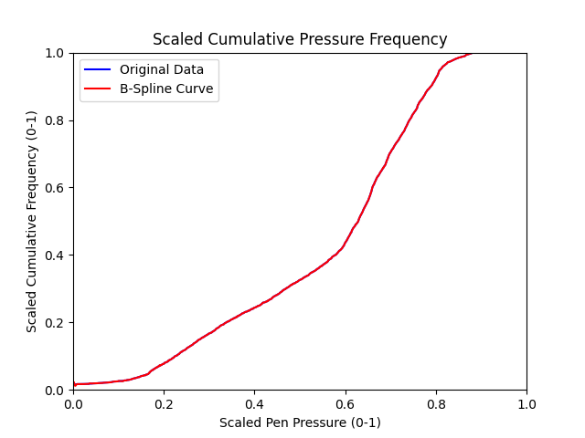

# Global pen pressure setting adjuster for Krita

## Introduction

This is a Python script that helps you adjust the pen pressure setting for Krita. It collects the pen pressure data from your tablet and generates a B-Spline curve that approximates the data. The curve is then converted into a Krita configuration line, which you can use to overwrite the `tabletPressureCurve` line in the [`kritarc`](https://docs.krita.org/en/reference_manual/preferences.html) file.

## Prerequisites

You need Python 3.11 or later to run this script. **This script only works on Linux.**

## Usage

1. Clone this repository and `cd` into it.

    ```bash
    git clone https://github.com/toku-sa-n/Krita-pen-pressure-adjuster
    cd Krita-pen-pressure-adjuster
    ```

2. Install the required packages.

    ```bash
    pip install -r requirements.txt
    ```

3. Run the script. You may need the root privilege to access the input device file.

    ```bash
    python src/main.py /dev/input/eventX
    ```

    where `/dev/input/eventX` is the path to the tablet input device file. You can find the path by running `evtest` and looking for the device name.

4. Use your pen to draw lines with different pressure levels. You don't need to draw with Krita. The script will collect the pressure data. Press `Ctrl+C` to finish the data collection. Note that few strokes will not be enough to generate a good pen pressure curve.

5. Two files will be generated: `graph.png` and `pen_pressure.txt`. The former contains a cumulative graph of the actual pen pressure and its frequency, and a B-Spline curve that approximates the graph. The latter contains the Krita configuration line for the pen pressure curve.     Overwrite the `tabletPressureCurve` line in the [`kritarc`](https://docs.krita.org/en/reference_manual/preferences.html) file with the line in `pen_pressure.txt`.

    Here is an example of a good graph. You can see that the B-Spline curve almost overlaps the curve of the original pressure data.

    

    And here is an example of a bad graph. You can see that the B-Spline curve is distorted and does not overlap the curve of the original pressure data. You may get a bad graph if you don't draw enough strokes. In this case, you should try again with more strokes.

    

## License

This program is free software: you can redistribute it and/or modify it under the terms of the GNU Affero General Public License as published by the Free Software Foundation, either version 3 of the License, or (at your option) any later version.

This program is distributed in the hope that it will be useful, but WITHOUT ANY WARRANTY; without even the implied warranty of MERCHANTABILITY or FITNESS FOR A PARTICULAR PURPOSE.  See the GNU Affero General Public License for more details.

You should have received a copy of the GNU Affero General Public License along with this program.  If not, see <https://www.gnu.org/licenses/>.
